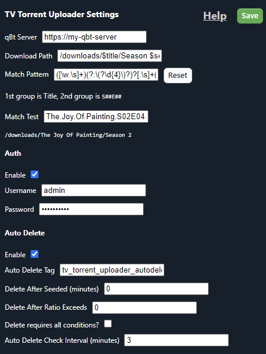
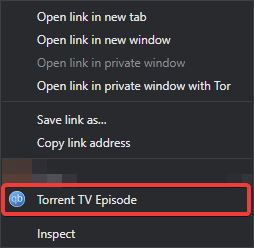

# qBt TV Torrent Uploader
This is a Chrome Extension that will add a context menu item to links to auto upload TV Episode magnet torrent links to qbt.

It will auto parse title, season number, and episode number.

You can provide the download path using these variables as many or as little as you want:
* `$title`
* `$season`
* `$episode`

Example `My.Favorite.TV.Show.S04E10.....` with path `/media/TV Shows/$title/Season $season`
would parse out to `/media/TV Shows/My Favorite TV Show/Season 4`.

## Config
* qBt Server - http/https URL to your qBt webui
* Download Path - The download path (with the aforementioned variables) to save the torrent to
* Match Pattern - Regular Expression pattern using 2 capture groups. 
  * First group must be show title
  * Second group must be `S##E##`
  * Match Pattern is always case-insensitive
  * [JavaScript Regular Expressions](https://developer.mozilla.org/en-US/docs/Web/JavaScript/Guide/Regular_Expressions)
  * [RegEx101](https://regex101.com/)
  * Default Pattern: `([\w.\s]+)(?:\(?\d{4}\)?)?[.\s]+(s\d+e\d+)`
    * Captures show titles from torrents using spaces or `.` separators
    * Drops year (if present) from show title
* Match Test - Test String against Match Pattern and Download Path (results are shown below)
* Auth Enable - Enable Login for username/password protected webui
  * Username - qBt WebUI Login Username
  * Password - qBt WebUI Login Password
* Auto Delete Enable - Enable auto deletion of torrents added by this extension
* Delete After Seeded - Number of minutes required to seed before deletion
* Delete After Ratio - Minimum ratio required to delete
* Delete requires all conditions - Both Delete After Seed and Delete After Ratio have to be meet to delete
* Auto Delete Check Interval - Number of minutes to check for torrents to delete.
